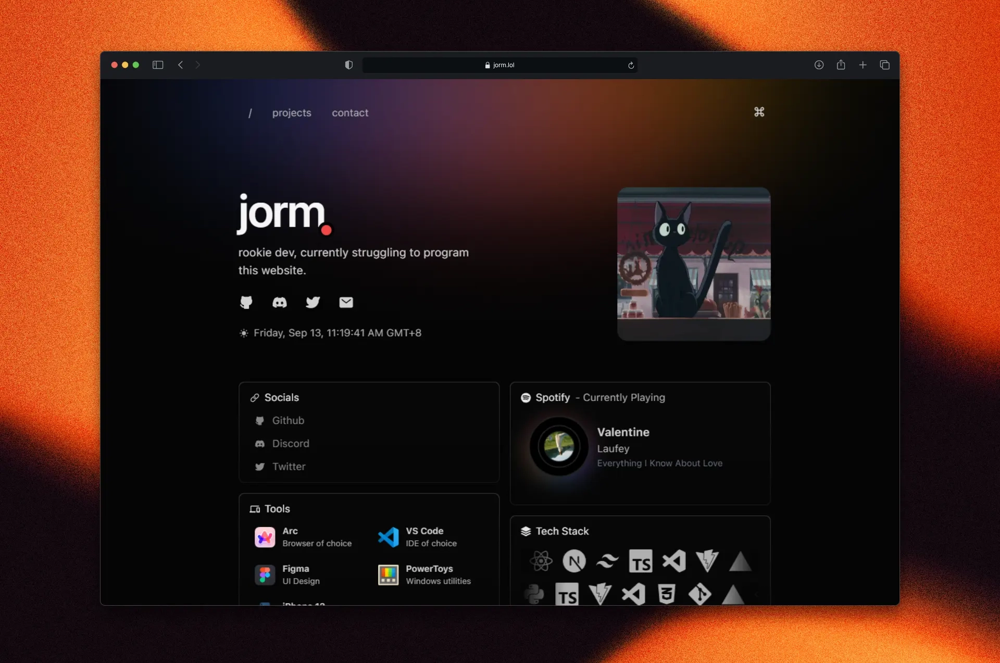

  

<h1 align="center">
  jorm.lol
</h1>

  
  
  

My personal site. Totally not the third time i've rewritten it.

## Tech Stack

- Framework - [Next.js 14 w/ App Router](https://nextjs.org/)
- Styling - [TailwindCSS](https://tailwindcss.com/)
- Animation - [Framer Motion](https://framer.com/motion/)
- Deployment - [Vercel](https://vercel.com/)
