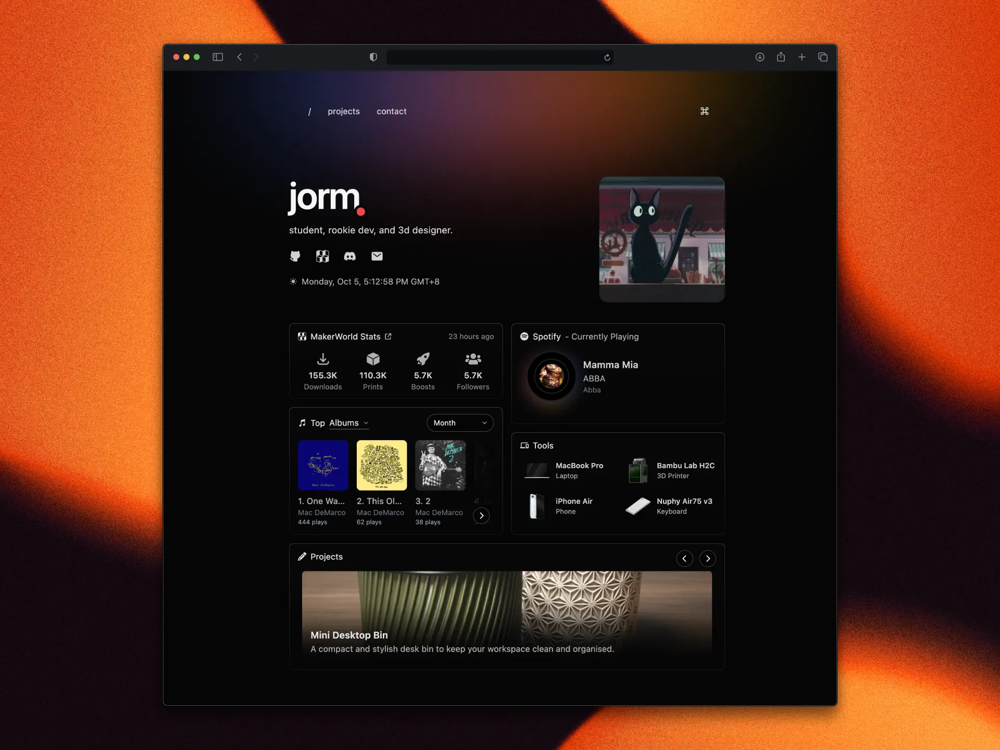

  

<h1 align="center">
  <a href="https://jorm.lol">jorm.lol</a>
</h1>

  
  
  

my personal portfolio showcasing my projects, interests, 3D designs, experiments, and other things I've made.

## Features

- Music integration - Shows currently listening to (or last played) song through Spotify, alongside listening stats from Last.fm.

- Discord presence - Shows my current Discord status, including online, idle, DND, and offline states via Lanyard API.

- Bento-grid style homepage - Interactive cards highlighting the things that represent me, including my projects, music, and online profiles.

- MakerWorld profile and stats updated periodically via Vercel Global Config

- Projects page - showcases for my 3D-printing and CAD projects. Can be toggled from code to CAD projects with buttons for each "tab"

- Adaptive navbar that changes background from clear to translucent when scrolling over content, inspired by Apple's Liquid Glass.

- Command menu - Press ⌘ K to quickly access different actions with just your keyboard.

## About

This site is a refresh of the personal website I originally built when I was 14. Rather than completely starting over, I revisited the code I wrote years ago and rebuilt the parts that no longer represented me (which was quite a lot)

## Tech Stack

- Framework - [Next.js 16 w/ App Router](https://nextjs.org/)
- Styling - [TailwindCSS](https://tailwindcss.com/)
- Animation - [Framer Motion](https://framer.com/motion/)
- Deployment - [Vercel](https://vercel.com/)

  <h2>Showcase Video</h2>

https://github.com/user-attachments/assets/b37815d7-ab4b-4c2f-bfd2-c9404fbeca88

